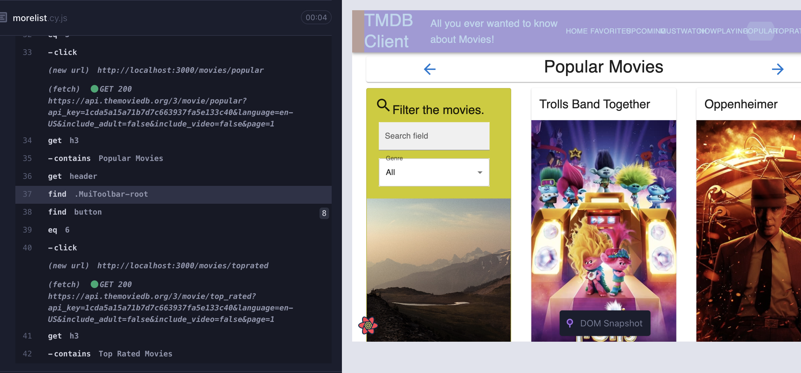
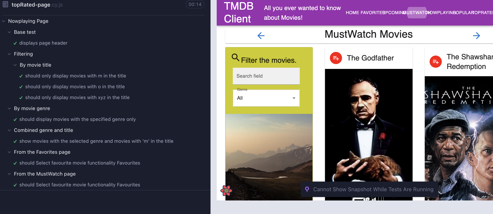

# agile-movie-assignment1

Name:Yangqing Li

This repository contains React applications and contains Cypress tests and GitLab CI pipelines.

## React App Features.

+ Upcoming Movies Page
+ top Rated Page
+ popularMovies page
+ now Playing Page
+ actor pages
+ actor filter
+ can return homepage from movie details page
+ can return actor page from movie details page
+ login page 
+ must watch button to add to must watch page

### Unique functionality testing (if relevant).

+ cypress/e2e/upComing-Page.cy.js

+ cypress/e2e/review-page.cy.js

+ cypress/e2e/actor-page.cy.js

+ cypress/e2e/home-page.cy.js

+ cypress/e2e/morelist.cy.js

+ cypress/e2e/nowplaying-page.cy.js

+ cypress/e2e/topRated-page.cy.js

### Code Splitting.

+ src/index.js
+ src/pages/homePage.js
+ src/components/templatePage/templateActorListPage/index.js
+ src/components/templatePage/templateMovieListPage/index.js
+ src/components/actor/actorList/index.js
+ src/components/movie/filterMoviesCard/index.js
+ src/components/movie/movieList/index.js

### Build 
